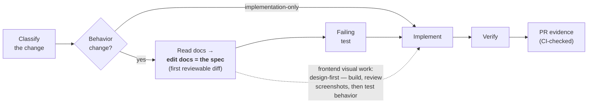
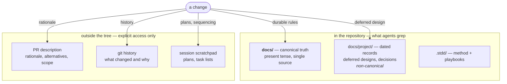

<h1 align="center">stdd</h1>

<p align="center"><strong>S</strong>pec + <strong>T</strong>est <strong>D</strong>riven <strong>D</strong>evelopment — a markdown-first methodology kit for teams building software with AI coding agents.</p>

<p align="center">
  <a href="https://github.com/vsem-azamat/stdd/actions/workflows/ci.yml"></a>
  <a href="https://www.npmjs.com/package/@stdd/cli"></a>
  <a href="https://www.npmjs.com/package/@stdd/cli"></a>
  
  
  <a href="./LICENSE"></a>
</p>

<p align="center">
  <a href="https://www.npmjs.com/package/@stdd/cli"><strong>📦&nbsp; @stdd/cli on npm</strong></a>
</p>

stdd ships three things: a written method contract, agent-neutral playbooks
compiled per agent, and a zero-dependency CLI that enforces the mechanical
part — a docs evidence line on every PR, no committed working artifacts, no
temporal narrative in canonical docs, no stale generated files.

## Why

AI coding agents amplify a specific failure mode: **committed working
artifacts**. Plans and spec files written for one change land in the repo,
go stale, and keep winning code search — an agent greps the tree, finds a
convincing month-old spec, and builds against it. Frameworks that model
changes as committed folders institutionalize this: archives accumulate
authoritative-looking text with no machine-readable authority.

stdd inverts the model. The permanent documentation tree is the single
source of truth. The edit to that tree is the spec — it comes first, as a
reviewable diff, before the failing test; the failing test comes before the
implementation. Ephemeral material stays out of the tree: rationale in the
PR description, history in git, deferred designs as dated project-log
records. What can be verified mechanically, CI verifies; the rest is a
written contract to review against — not folklore.

## The loop



## Where knowledge lives

One truth inside the tree; everything ephemeral outside it — an agent
grepping the repository can only find the present. The one dated exception,
the project log, is marked machine-readably (`authority: non-canonical`
frontmatter), and the generated agent instructions forbid searching it
unless the user explicitly asks for history or deferred work.



## Requirements

- Node.js 20+ and git.
- `stdd ci` and `stdd check-pr --pr` shell out to the
  [GitHub CLI](https://cli.github.com) (`gh`), authenticated for the
  repository. Every other command is offline.

## Quick start

```bash
cd your-project
npx @stdd/cli init --tools claude,codex
```

Or install globally — the command is called `stdd`:

```bash
npm install -g @stdd/cli
stdd init --tools claude,codex
```

`stdd init` installs `.stdd/` (the method contract + playbooks + config),
generates Claude Code skills, and prints the section to add to your
`AGENTS.md` for Codex and any other agent that reads it. Everything it
generates is recorded with content hashes in `.stdd/manifest.json`, so
`check` and `doctor` detect hand edits and stale copies of any generated
file — not just version drift.

To assess an existing repository first:

```console
$ npx @stdd/cli doctor
✗ 6 committed working artifacts may mislead coding agents
✗ 2 canonical docs contain temporal narrative
✓ generated files match stdd v0.4.0
✗ AGENTS.md has no STDD section — paste .stdd/AGENTS-snippet.md
```

Then wire the guards into CI. On GitHub, generate the canonical workflow:

```console
$ npx @stdd/cli init --ci github
```

It writes `.github/workflows/stdd.yml`: `stdd check` for tree invariants,
and `stdd check-pr --base` against the PR body **fetched live from the
API**. Do not read the body from `github.event.pull_request.body` — that
payload is frozen at trigger time, so a body-only fix is never re-validated
and a re-run replays the stale text. `stdd doctor` flags workflows using
that form without an `edited` trigger.

## A change, end to end

```console
$ stdd docs updated-first docs/domain/pricing.md   # commit 1 — the docs edit is the spec
$ stdd red -- npm test                             # commit 2 — failing test, recorded
$ stdd verify -- npm test                          # commit 3 — implementation, green run recorded
$ stdd status
loop:   docs ✓ (updated-first: docs/domain/pricing.md)
        red  ✓ (genuine: yes, exit 1: npm test)
        impl ✓ (working tree has non-doc changes)
        verify ✓ (exit 0: npm test)
next:   draft the evidence line via `stdd evidence`, then open the PR
$ stdd evidence --base origin/main
Docs updated first: docs/domain/pricing.md
$ stdd ci --watch
stdd ci: green (5 checks) on 1f0c9e2 — terminal
```

## Commands

| Command | What it does |
| --- | --- |
| `stdd init [dir] [--tools claude,codex] [--ci github] [--hooks] [--capabilities <list>] [--session-hook] [--interview]` | Install `.stdd/` and compile playbooks per agent against the config's capability profile; `--ci github` writes the canonical workflow; `--hooks` writes a user-owned pre-push hook running `stdd check`; `--capabilities` writes the profile into the config; `--session-hook` wires a Claude Code `SessionStart` hook running `stdd status`; `--interview` asks one question at a time, then runs the same init |
| `stdd doctor [dir] [--readiness]` | Adoption health report: setup, canonical docs, misleading artifacts, drift, worktree readiness — exits 1 on findings; `--readiness` runs only the config-declared readiness checks |
| `stdd check [dir]` | CI guard: no committed working artifacts, no temporal narrative in canonical docs, no stale or hand-edited generated files, no tracked bookkeeping (`.stdd/ledger.jsonl`, `.stdd/plan.md`); enforces `branchPattern` and `contentRules` when configured |
| `stdd evidence --base <ref>` | Draft the evidence line from the actual diff: prints a finished `Docs updated first:` line when canonical docs changed; otherwise the remaining sentinel templates go to stderr and it exits nonzero |
| `stdd check-pr <file\|-> [--base <ref>] [--pr <n\|.>]` | CI guard: PR body carries exactly one non-empty docs evidence line; with `--base`, claimed doc paths are verified against the actual git diff; `--pr` fetches and validates the live PR body against its own base and head |
| `stdd status [--json]` | Next-step oracle: where in the loop this checkout is (git diff, ledger, plan, forge) and the concrete next step |
| `stdd ci [pr] [--watch] [--interval <s>] [--timeout <s>]` | The branch PR's checks on its **current head**; duplicate rollup entries per check name collapse to the freshest run; `--watch` polls to a terminal state, never settles on a partial check set, restarts when the head moves, exits nonzero on a terminal failure |
| `stdd docs <decision> [paths…] [--reason <why>]` | Record the docs decision (`updated-first`, `checked`, `not-applicable`) in the session ledger when it is made |
| `stdd red -- <cmd>` / `stdd verify -- <cmd>` | Run the command, record `{cmd, exit, excerpt}` in the ledger, pass the exit code through; `red` asserts genuine-red via the config's `redPattern` |
| `stdd note <text>` | Record free-form handoff context in the ledger |
| `stdd defer <text>` | Record a scope cut under the durable plan's `## Deferred` section (`.stdd/plan.md`) |
| `stdd slice new --frozen <globs> --allowed <globs>` | Declare a delegated slice's scope and snapshot the checkout baseline (head + dirty-file hashes) into the ledger |
| `stdd scope` | Postflight check against the slice baseline: session-introduced changes to frozen paths or outside allowed paths fail; inherited dirt is reported separately, never blamed |

## Configuration

All checks read `.stdd/config.json`, merged over built-in defaults:

| Key | Purpose |
| --- | --- |
| `forbiddenArtifacts` | Globs for working artifacts that must never be committed |
| `canonicalDocs` | Globs for the canonical docs tree; the temporal-narrative lint and evidence verification apply to these files |
| `temporalPhrases` | Phrases flagged as temporal narrative in canonical docs |
| `contentRules` | Repo-authored content lints — `{ name, files, forbid` and/or `require, message?, newFilesOnly? }` — enforced by `stdd check` |
| `readiness.required` | `{ path, hint }` entries a fresh worktree needs before verification output can be trusted |
| `capabilities` | Agent-environment profile (`subagents`, `crossCli`, `worktrees`); playbooks are compiled against it at init time |
| `baseRef` | Default base ref for diff-derived checks, e.g. `origin/main` |
| `redPattern` | Regex a genuine test failure must match; without it, `stdd red` cannot distinguish a real red from an environment error |
| `branchPattern` | Regex the current branch must match; enforced by `stdd check` |

Project-specific recipes in `.stdd/playbooks/local/` compile through the
same pipeline as the kit's playbooks and override them by `name`.

## Session state

Two per-checkout files under `.stdd/` are working artifacts — advisory
input, never a gate — and `stdd check` fails if either is tracked by git:

- **`.stdd/ledger.jsonl`** — append-only session ledger. `stdd docs`,
  `red`, `verify`, and `note` append to it; `status` and `evidence` derive
  loop state from it instead of reconstructing it from conversation memory.
- **`.stdd/plan.md`** — durable plan. Checkbox items survive session
  compaction and handoff; an item tagged `[red: <substring>]` counts as
  done only when the ledger holds a matching genuine red run; scope cuts
  are recorded under `## Deferred` with `stdd defer`.

Details: "The session ledger and `stdd status`" in the
[method](method/README.md).

## Repository layout

| Path | Contents |
| --- | --- |
| [`method/`](method/README.md) | The STDD contract: the loop, the rules, the exceptions |
| [`playbooks/`](playbooks/) | Agent-neutral playbooks: brainstorming, planning, debugging, investigation, worktrees, pr-green, delegate-slice |
| [`templates/`](templates/) | PR description and deferred-design templates |
| [`adapters/`](adapters/README.md) | How playbooks compile per agent |
| [`cli/`](cli/) | Zero-dependency Node CLI |

## The method in five rules

1. **Classify first.** Behavior changes (anything observable) pass the full
   loop; implementation-only changes skip the docs step.
2. **The docs edit is the spec.** Missing or stale docs are updated before
   tests and code, as the first reviewable unit of the change.
3. **Red before green.** A failing test gates every behavior change —
   except frontend *visual* work, which is design-first: build, review
   screenshots, then test only real behavior contracts.
4. **Working artifacts are never committed.** Rationale → PR description;
   history → git; deferred designs → dated project-log entries.
5. **Evidence, not claims.** Every PR states `Docs updated first:` /
   `Docs checked, no change needed:` / `Docs not applicable:` — naming the
   docs or the reason. CI rejects a missing, duplicated, or bare label, and
   with `--base` verifies the claimed doc paths against the actual diff.

The full contract: [`method/README.md`](method/README.md).

## Related work

**[OpenSpec](https://github.com/Fission-AI/OpenSpec)** models changes as
committed folders that archive into the repo, so specs accumulate alongside
a separate docs reality. stdd keeps one truth — the docs tree — and borrows
the delta discipline, drift detection, and init/update UX without the
archive.

**[Superpowers](https://github.com/obra/superpowers)** ships strong process
content, Claude-only, through plugin hooks. stdd states the process
agent-neutrally and compiles it for each agent a team runs.

## Development

```bash
npm ci
npm test          # node:test — unit + CLI integration
npm run check     # Biome (Rust) — lint + format, CI mode
npm run format    # Biome — write fixes
npm run selfcheck # stdd check on this repo (dogfooding)
```

This repository follows its own method: PRs carry a docs evidence line
(enforced in CI by `stdd check-pr`), and no working artifacts are
committed. See [CONTRIBUTING.md](CONTRIBUTING.md).

## License

[MIT](LICENSE)
