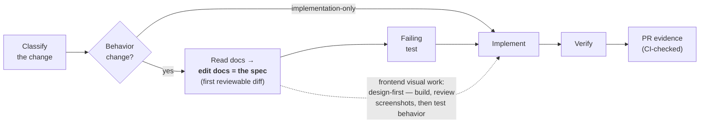

<h1 align="center">stdd</h1>

<p align="center"><strong>S</strong>pec + <strong>T</strong>est <strong>D</strong>riven <strong>D</strong>evelopment — a markdown-first methodology kit for teams building software with AI coding agents.</p>

<p align="center">
  <a href="https://github.com/vsem-azamat/stdd/actions/workflows/ci.yml"></a>
  <a href="https://www.npmjs.com/package/@stdd/cli"></a>
  
  
  <a href="./LICENSE"></a>
</p>

```text
→ the docs edit IS the spec — reviewed before any code
→ tests gate behavior; visuals are design-first
→ working artifacts are never committed
→ one agent-neutral source, compiled per agent
→ mechanics over discipline — what can be checked, CI checks
```

## Why

AI coding agents amplify a quiet failure mode: **committed working artifacts**.
Plans and spec files written for one change land in the repo, go stale, and
keep winning code search — an agent greps the tree, finds a convincing
month-old spec that a newer doc contradicts, and confidently builds the wrong
thing. Popular SDD frameworks make this worse by design: change folders and
archives accumulate authoritative-looking text with no machine-readable
authority.

stdd inverts the model. Your permanent documentation tree is the **single**
source of truth. The edit to that tree is the spec — it comes first, in a
reviewable diff, before the failing test; the failing test comes before the
implementation. Everything ephemeral lives where ephemeral things belong:
rationale in the PR description, history in git, deferred designs as dated
project-log records. What can be verified mechanically, CI verifies; the
rest is a written contract you review against — not folklore.

## The loop



## Where knowledge lives

One truth inside the tree; everything ephemeral outside it — so an agent
grepping the repo can only find the present. The one dated exception, the
project log, is marked machine-readably (`authority: non-canonical`
frontmatter) and the generated agent instructions forbid searching it
unless the user explicitly asks for history or deferred work.


## See it in action

```text
You: We need admins to adjust an order's price before invoicing.

AI:  [stdd-brainstorming] One question: order-level or per-item? …
     Agreed: order-level signed adjustment, review-status only, reason
     required, customer notified.

AI:  Commit 1 — docs/domain/pricing.md: "Manual Price Adjustment" rules.
     (the spec, reviewable on its own)
AI:  Commit 2 — failing integration test for the new rules.
AI:  Commit 3 — implementation; test green; verification output attached.

PR body:
     Docs updated first: docs/domain/pricing.md
     Decisions and alternatives: per-item adjustment rejected because …

CI:  stdd check     ✓ no committed working artifacts, no temporal narrative
     stdd check-pr  ✓ evidence line names the changed docs
```

## Quick start

```bash
cd your-project
npx @stdd/cli init --tools claude,codex
```

Or install globally — the command is called `stdd`:

```bash
npm install -g @stdd/cli
stdd init --tools claude,codex
```

`stdd init` installs `.stdd/` (the method contract + playbooks + config),
generates Claude Code skills, and prints the section to add to your
`AGENTS.md` for Codex and any other agent that reads it. Everything it
generates is recorded with content hashes in `.stdd/manifest.json`, so
`check` and `doctor` detect hand edits and stale copies of any generated
file — not just version drift.

Not sure where an existing repo stands? Get a report in seconds:

```console
$ npx @stdd/cli doctor
✗ 6 committed working artifacts may mislead coding agents
✗ 2 canonical docs contain temporal narrative
✓ generated files match stdd v0.0.2
✗ AGENTS.md has no STDD section — paste .stdd/AGENTS-snippet.md
```

Then wire the guards into CI. On GitHub, generate the canonical workflow:

```console
$ npx @stdd/cli init --ci github
```

It writes `.github/workflows/stdd.yml`: `stdd check` for tree invariants,
and `stdd check-pr --base` against the PR body **fetched live from the
API**. Do not read the body from `github.event.pull_request.body` — that
payload is frozen at trigger time, so a body-only fix is never re-validated
and a re-run replays the stale text. `stdd doctor` flags workflows using
that form without an `edited` trigger.

## Commands

| Command | What it does |
| --- | --- |
| `stdd init [dir] [--tools claude,codex] [--ci github]` | Install `.stdd/` and compile playbooks per agent; `--ci github` writes the canonical workflow |
| `stdd doctor [dir]` | Adoption health report: setup, canonical docs, misleading artifacts, drift — exits 1 on findings |
| `stdd check [dir]` | CI guard: no committed working artifacts, no temporal narrative in canonical docs, no stale or hand-edited generated files |
| `stdd evidence --base <ref>` | Draft the evidence line from the actual diff: prints a finished `Docs updated first:` line when canonical docs changed; otherwise the remaining sentinel templates go to stderr and it exits nonzero |
| `stdd check-pr <file\|-> [--base <ref>] [--pr <n\|.>]` | CI guard: PR body carries exactly one non-empty docs evidence line; with `--base`, claimed doc paths are verified against the actual git diff; `--pr` fetches and validates the live PR body against its own base and head |

All checks are configured in `.stdd/config.json` (glob patterns for
forbidden artifacts, canonical docs, temporal phrases).

## What's in the box

| Path | Contents |
| --- | --- |
| [`method/`](method/README.md) | The STDD contract: the loop, the rules, the exceptions |
| [`playbooks/`](playbooks/) | Agent-neutral playbooks: brainstorming, planning, debugging, worktrees |
| [`templates/`](templates/) | PR description and deferred-design templates |
| [`adapters/`](adapters/README.md) | How playbooks compile per agent |
| [`cli/`](cli/) | Zero-dependency Node CLI |

## The method in five rules

1. **Classify first.** Behavior changes (anything observable) pass the full
   loop; implementation-only changes skip the docs step.
2. **The docs edit is the spec.** Missing or stale docs are updated before
   tests and code, as the first reviewable unit of the change.
3. **Red before green.** A failing test gates every behavior change —
   except frontend *visual* work, which is design-first: build, review
   screenshots, then test only real behavior contracts.
4. **Working artifacts are never committed.** Rationale → PR description;
   history → git; deferred designs → dated project-log entries.
5. **Evidence, not claims.** Every PR states `Docs updated first:` /
   `Docs checked, no change needed:` / `Docs not applicable:` — naming the
   docs or the reason. CI rejects a missing, duplicated, or bare label, and
   with `--base` verifies the claimed doc paths against the actual diff.

The full contract: [`method/README.md`](method/README.md).

## How it compares

**vs. [OpenSpec](https://github.com/Fission-AI/OpenSpec)** — OpenSpec models
changes as committed folders that archive into the repo; specs accumulate
alongside a separate docs reality. stdd keeps one truth (your docs tree),
borrows OpenSpec's best mechanics (delta discipline, drift detection,
init/update UX), and rejects the archive.

**vs. [Superpowers](https://github.com/obra/superpowers)** — great process
content, but Claude-only and delivered through plugin hooks. stdd rewrites
the process agent-neutrally and compiles it for every agent your team runs.

**vs. nothing** — chat context evaporates; agents build before agreeing on
scope; stale plans mislead the next session. stdd fixes the workflow, not
the model.

## Development

```bash
npm ci
npm test          # node:test — unit + CLI integration
npm run check     # Biome (Rust) — lint + format, CI mode
npm run format    # Biome — write fixes
npm run selfcheck # stdd check on this repo (dogfooding)
```

This repository follows its own method: PRs carry a docs evidence line
(enforced by CI via `stdd check-pr`), and no working artifacts are committed.

## License

[MIT](LICENSE)
