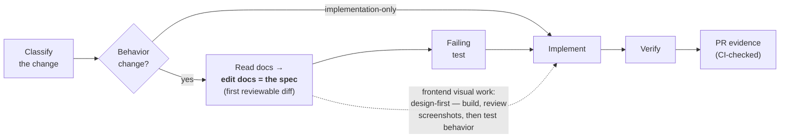

<h1 align="center">stdd</h1>

<p align="center"><strong>S</strong>pec + <strong>T</strong>est <strong>D</strong>riven <strong>D</strong>evelopment — a markdown-first methodology kit for teams building software with AI coding agents.</p>

<p align="center">
  <a href="https://github.com/vsem-azamat/stdd/actions/workflows/ci.yml"></a>
  <a href="https://www.npmjs.com/package/@stdd/cli"></a>
  <a href="https://www.npmjs.com/package/@stdd/cli"></a>
  
  
  <a href="./LICENSE"></a>
</p>

<p align="center">
  <a href="https://www.npmjs.com/package/@stdd/cli"><strong>📦&nbsp; @stdd/cli on npm</strong></a>
</p>

stdd ships five things: a written method contract, agent-neutral playbooks
compiled per agent, a zero-dependency CLI that enforces the mechanical part,
an optional Codex plugin distribution, and a small public JavaScript API for
integrations. Its distinctive layer is
repository evidence: a docs evidence line on every PR, authority-aware
artifact policy, current-state canonical docs, and stale-proof loop/review
state.

## Why

AI coding agents amplify a specific failure mode: **committed working
artifacts**. Plans and spec files written for one change land in the repo,
go stale, and keep winning code search — an agent greps the tree, finds a
convincing month-old spec, and builds against it. Frameworks that model
changes as committed folders institutionalize this: archives accumulate
authoritative-looking text with no machine-readable authority.

stdd inverts the model. The permanent documentation tree is the source of
truth for current behavior. Once a behavior is agreed, the edit to that tree
is the spec — it becomes the first reviewable diff before the failing test;
exploratory spikes may precede that commitment and are discarded or
reclassified before review. Ephemeral material stays non-canonical: rationale
in the PR description, history in git, and deferred designs as explicitly
marked project-log records. What can be verified mechanically, CI verifies;
the rest is a written contract to review against — not folklore.

## The loop


```mermaid
flowchart LR
    A["Classify<br/>the change"] --> B{"Behavior<br/>change?"}
    B -- "implementation-only" --> E["Implement"]
    B -- "yes" --> C["Read docs →<br/><b>edit docs = the spec</b><br/>(first reviewable diff)"]
    C --> D["Failing<br/>test"]
    D --> E
    E --> F["Verify"]
    F --> G["PR evidence<br/>(CI-checked)"]

    C -. "frontend visual work:<br/>design-first — build, review<br/>screenshots, then test behavior" .-> E
```

## Where knowledge lives

One truth inside the tree; everything ephemeral outside it — an agent
grepping the repository can only find the present. The one dated exception,
the project log, is marked machine-readably (`authority: non-canonical`
frontmatter), and the generated agent instructions forbid searching it
unless the user explicitly asks for history or deferred work.


```mermaid
flowchart TD
    CH(["a change"])

    subgraph TREE["in the repository — what agents grep"]
        DOCS["<b>docs/</b> — canonical truth<br/>present tense, single source"]
        LOG["docs/project/ — dated records<br/>deferred designs, decisions<br/><i>non-canonical</i>"]
        STDD[".stdd/ — method + playbooks"]
    end

    subgraph OUT["outside the tree — explicit access only"]
        PR["PR description<br/>rationale, alternatives, scope"]
        GIT["git history<br/>what changed and why"]
        PAD["session scratchpad<br/>plans, task lists"]
    end

    CH -- "durable rules" --> DOCS
    CH -- "deferred design" --> LOG
    CH -- "rationale" --> PR
    CH -- "history" --> GIT
    CH -- "plans, sequencing" --> PAD
```

## Adoption levels

Adopt only the layer that solves today's problem. The layers are cumulative,
but none requires enabling the next:

1. **Core contract** — `init`, `check`, and `check-pr`: canonical docs,
   generated-file drift, artifact policy, and PR evidence.
2. **Recorded workflow** — add `docs`, `red`, `verify`, and `status`: loop
   facts survive compaction and are invalidated when the checkout changes.
3. **Orchestration** — add plans, slices, worktrees, independent review, and
   hooks when the team actually delegates multi-step work.

The quick start installs the complete kit, but the advanced commands stay
opt-in. A team can begin with the two CI guards and grow into the rest.

## Requirements

- Node.js 20+ and git.
- `stdd init`, `stdd configure`, `stdd task reset`, and review commands that
  create or settle private artifacts currently require Linux because secure
  publication, atomic reset, and settlement use a held-parent pathname bridge.
  On unsupported platforms they fail before cleanup-journal recovery,
  generated install mutation, reset transaction creation, review request
  creation, or private-artifact mutation.
- `stdd ci`, `stdd check-pr --pr`, and the forge portion of plain
  `stdd status` shell out to the
  [GitHub CLI](https://cli.github.com) (`gh`), authenticated for the
  repository. `stdd review --via codex|claude` launches the selected
  model-backed CLI and may use its configured network access. `stdd status
  --local` and the remaining local workflow commands are offline.

## Quick start

For a durable project install, pin the CLI as a development dependency. Hooks
and agent sessions then use the local binary offline:

```bash
npm install --save-dev --save-exact @stdd/cli
npm exec --offline --package=@stdd/cli -- stdd init --tools claude,codex
```

Inside the `@stdd/cli` source repository itself, generated dogfood automation
invokes the checked-out `cli/stdd.mjs` through the git root. Consumer projects
continue to use the exact scoped package runner above.

For a one-off assessment without installing, use
`npx @stdd/cli doctor`. A global install also works, but generated automation
never relies on a global package or an unscoped package named `stdd`.

`stdd init` installs `.stdd/` (the method contract + playbooks + config),
generates Claude Code skills in `.claude/skills/` and Codex skills in
`.agents/skills/`, and maintains short managed sections in `CLAUDE.md` and
`AGENTS.md`. Everything it
generates is recorded with content hashes in `.stdd/manifest.json`, so
`check` and `doctor` detect hand edits and stale copies of any generated
file — not just version drift.

To assess an existing repository first:

```console
$ npx @stdd/cli doctor
✗ 6 committed working artifacts may mislead coding agents
✗ 2 canonical docs match configured temporal phrases
✓ generated files match stdd v0.7.0
✗ AGENTS.md has no STDD section — paste .stdd/AGENTS-snippet.md
```

Then wire the guards into CI. Provider files are optional adapters around the
same CLI contract:

```console
$ npx @stdd/cli init --ci github
$ npx @stdd/cli init --ci gitlab
$ npx @stdd/cli init --ci generic   # print commands; write no provider file
```

It writes `.github/workflows/stdd.yml`: `stdd check` for tree invariants,
and `stdd check-pr --base` against the PR body **fetched live from the
API**. Do not read the body from `github.event.pull_request.body` — that
payload is frozen at trigger time, so a body-only fix is never re-validated
and a re-run replays the stale text. `stdd doctor` flags workflows using
that form without an `edited` trigger.

GitLab writes an includeable `.gitlab/stdd.gitlab-ci.yml` job. Same-project
merge requests use the short-lived `CI_JOB_TOKEN`. A fork pipeline runs in
the source project, so the target project must put that source project on its
[CI job-token allowlist](https://docs.gitlab.com/ci/jobs/ci_job_token/), or
the job fails with that setup instruction. For a controlled, trusted fork,
`STDD_GITLAB_READ_API_TOKEN` can instead hold a masked and hidden,
target-project access token with only `read_api`. Never expose a target token
to an untrusted fork or run fork-controlled CI code with parent-project
secrets; [GitLab warns that fork code can exfiltrate CI/CD variables](https://docs.gitlab.com/ci/pipelines/merge_request_pipelines/#run-pipelines-in-the-parent-project).
Generic mode prints the portable `check` and `check-pr - --base` commands for
Jenkins, Buildkite, or an existing pipeline.

## Invoke workflows

The playbook source is shared, but each host keeps its native invocation UX:

| Workflow | Claude Code | Codex |
| --- | --- | --- |
| Start/classify a change | `/stdd-start-change` | `$stdd-start-change` |
| Execute docs/red/green/verify | `/stdd-implement` | `$stdd-implement` |
| Close review, PR, CI, runtime proof | `/stdd-finish-change` | `$stdd-finish-change` |

Descriptions also allow either agent to select a matching skill implicitly.
The always-on instruction files carry only invariants and routing; full
workflows load on demand.

## A change, end to end

```console
$ stdd task start "gross pricing"
$ stdd docs updated-first docs/domain/pricing.md   # commit 1 — the docs edit is the spec
$ stdd red -- npm test                             # commit 2 — failing test, recorded
$ stdd verify -- npm test                          # commit 3 — implementation, green run recorded
$ stdd status
loop:   docs ✓ (updated-first: docs/domain/pricing.md)
        red  ✓ (genuine: yes, exit 1: npm test)
        impl ✓ (checkout changed after the red snapshot)
        verify ✓ (exit 0: npm test)
next:   draft the evidence line via `stdd evidence`, then open the PR
$ stdd evidence --base origin/main
Docs updated first: docs/domain/pricing.md
$ stdd ci --watch
stdd ci: green (5 checks) on 1f0c9e2 — terminal
$ stdd task finish
```

## Commands

| Command | What it does |
| --- | --- |
| `stdd init [dir] [--tools claude,codex] [--ci github,gitlab,generic] [--hooks] [--capabilities <list>] [--session-hook] [--stop-hook] [--interview]` | Install `.stdd/` and compile native skills/instructions per agent; generated CI is pinned to this stdd version, and hooks use the project-local binary offline |
| `stdd configure [dir] [--capabilities <list>] [--review-via <route>] [--max-rounds <n>] [--stop-hook]` | Reconfigure capabilities and review routing without changing other project policy |
| `stdd doctor [dir] [--readiness]` | Adoption health report: setup, canonical docs, misleading artifacts, drift, worktree readiness — exits 1 on findings; `--readiness` runs only the config-declared readiness checks |
| `stdd check [dir]` | CI guard: repository artifact policy, configured temporal-phrase heuristic, generated-file integrity, and no tracked bookkeeping (`.stdd/ledger.jsonl`, `.stdd/plan.md`); enforces `branchPattern` and `contentRules` when configured |
| `stdd evidence --base <ref>` | Draft the evidence line from the actual diff: prints a finished `Docs updated first:` line when canonical docs changed; otherwise the remaining sentinel templates go to stderr and it exits nonzero |
| `stdd check-pr <file\|-> [--base <ref>] [--pr <n\|.>]` | CI guard: PR body carries exactly one non-empty docs evidence line; with `--base`, claimed doc paths are verified against the actual git diff; `--pr` fetches and validates the live PR body against its own base and head |
| `stdd task start <name>` / `finish` / `reset [name]` | Open, close, or deliberately replace the active task identity without deleting ledger evidence |
| `stdd status [--json\|--gate\|--local]` | Next-step oracle for the active task; `--local` skips forge access and is used by lifecycle hooks; `--gate` turns broken review claims into an exit code |
| `stdd ci [pr] [--watch] [--interval <s>] [--timeout <s>]` | The branch PR's checks on its **current head**; duplicate rollup entries per check name collapse to the freshest run; `--watch` polls to a terminal state, never settles on a partial check set, restarts when the head moves, exits nonzero on a terminal failure |
| `stdd docs <decision> [paths…] [--reason <why>]` | Record the docs decision (`updated-first`, `checked`, `not-applicable`) in the session ledger when it is made |
| `stdd red -- <cmd>` / `stdd verify -- <cmd>` | Run the command, record `{cmd, exit, excerpt}` in the ledger, pass the exit code through; `red` asserts genuine-red via the config's `redPattern` |
| `stdd note <text>` | Record free-form handoff context in the ledger |
| `stdd defer <text>` | Record a scope cut under the durable plan's `## Deferred` section (`.stdd/plan.md`) |
| `stdd slice new --frozen <globs> --allowed <globs>` | Declare a delegated slice's scope and snapshot the checkout baseline (head + dirty-file hashes) into the ledger |
| `stdd scope` | Postflight check against the slice baseline: session-introduced changes to frozen paths or outside allowed paths fail; inherited dirt is reported separately, never blamed |
| `stdd review [--via subagent\|codex\|claude] [--timeout <s>] [--force]` | Build a bounded brief, dispatch a fresh read-only reviewer, record the derived verdict, and invalidate it when the checkout changes |
| `stdd review --result <file\|->` | Complete an open subagent review and securely settle its private temporary artifacts |
| `stdd review --cleanup` | Cancel safely-settleable abandoned subagent or interrupted CLI requests and quarantine their zeroed private artifacts |
| `stdd stop-hook [--agent claude\|codex]` | Agent-specific Stop-hook protocol; blocks only broken review claims and otherwise fails open |
| `stdd version` / `stdd --version` | Print the installed CLI version |

## Configuration

All checks read `.stdd/config.json`, merged over built-in defaults:

| Key | Purpose |
| --- | --- |
| `forbiddenArtifacts` | Globs for working artifacts forbidden by this repository's authority policy |
| `canonicalDocs` | Globs for the canonical docs tree; the temporal-phrase heuristic and evidence verification apply to these files |
| `temporalPhrases` | Repository-language phrases heuristically flagged in canonical docs; code spans and fences are skipped |
| `contentRules` | Repo-authored content lints — `{ name, files, forbid` and/or `require, message?, newFilesOnly? }` — enforced by `stdd check` |
| `readiness.required` | `{ path, hint }` entries a fresh worktree needs before verification output can be trusted |
| `capabilities` | Agent-environment profile (`subagents`, `crossCli`, `worktrees`); playbooks are compiled against it at init time |
| `baseRef` | Default base ref for diff-derived checks, e.g. `origin/main` |
| `redPattern` | Regex a genuine test failure must match; without it, `stdd red` cannot distinguish a real red from an environment error |
| `branchPattern` | Regex the current branch must match; enforced by `stdd check` |

Project-specific recipes in `.stdd/playbooks/local/` compile through the
same pipeline as the kit's playbooks and override them by `name`.

## Session state

Two per-checkout files under `.stdd/` are working artifacts — advisory
input, never a gate — and the default policy makes `stdd check` fail if
either is tracked by git:

- **`.stdd/ledger.jsonl`** — append-only session ledger. `stdd docs`,
  `red`, `verify`, and `note` append to it; `status` and `evidence` derive
  loop state from it instead of reconstructing it from conversation memory.
- **`.stdd/plan.md`** — durable plan. Checkbox items survive session
  compaction and handoff; an item tagged `[red: <substring>]` counts as
  done only when the ledger holds a matching genuine red run; scope cuts
  are recorded under `## Deferred` with `stdd defer`.

The append-only ledger carries task boundaries. `stdd task start` gives new
work a random `taskId`; `finish` leaves the evidence in place but makes status
idle, and `reset` starts a fresh identity. Existing branch-only ledgers remain
readable, while legacy state on a clean base branch is ignored.

Details: "The session ledger and `stdd status`" in the
[method](method/README.md).

## Repository layout

| Path | Contents |
| --- | --- |
| [`method/`](method/README.md) | The STDD contract: the loop, the rules, the exceptions |
| [`playbooks/`](playbooks/) | Agent-neutral playbooks: brainstorming, planning, debugging, investigation, worktrees, pr-green, delegate-slice |
| [`templates/`](templates/) | PR description and deferred-design templates |
| [`adapters/`](adapters/README.md) | How playbooks compile per agent |
| [`cli/`](cli/) | Zero-dependency Node CLI and isolated adapter modules |
| [`sdk/`](sdk/) | Supported ESM API: config/parsing helpers, safe repository paths, snapshot-aware loop derivation |
| [`plugins/stdd/`](plugins/stdd/) | Installable Codex plugin bundle generated from the same playbooks |

## The method in five rules

1. **Classify first.** Behavior changes (anything observable) pass the full
   loop; implementation-only changes skip the docs step.
2. **The docs edit is the spec.** Once behavior is agreed, missing or stale
   docs are updated before tests and production code, as the first reviewable
   unit. Throwaway exploration may happen earlier but is not implementation
   proof.
3. **Red before green.** A failing test gates every behavior change —
   except frontend *visual* work, which is design-first: build, review
   screenshots, then test only real behavior contracts.
4. **Working artifacts are non-canonical by default.** The default policy
   keeps session plans and ledgers uncommitted. Teams that need an audit
   trail may keep selected records only when their non-canonical authority is
   machine-readable and their canonical-doc search boundary remains intact.
5. **Evidence, not claims.** Every PR states `Docs updated first:` /
   `Docs checked, no change needed:` / `Docs not applicable:` — naming the
   docs or the reason. CI rejects a missing, duplicated, or bare label, and
   with `--base` verifies the claimed doc paths against the actual diff.

The full contract: [`method/README.md`](method/README.md).

## Related work

**[OpenSpec](https://github.com/Fission-AI/OpenSpec)** models changes as
committed folders that archive into the repo, so specs accumulate alongside
a separate docs reality. stdd keeps one truth — the docs tree — and borrows
the delta discipline, drift detection, and init/update UX without the
archive.

**[Superpowers](https://github.com/obra/superpowers)** ships strong,
multi-agent process skills for brainstorming, planning, TDD, debugging, and
delivery. stdd complements that behavior layer with repository-level
evidence: diff-aware PR checks, current-state canonical docs, durable loop
facts, scope snapshots, and stale review invalidation.

## JavaScript API

`@stdd/cli` also exposes a dependency-free ESM entry point for integrations:

```js
import {
	deriveLoopState,
	extractDocPaths,
	mergeConfig,
	parseLedger,
	parsePlan,
	resolveRepoPath,
	STDD_VERSION,
} from "@stdd/cli";
```

The root export is the supported API. It also exports `DEFAULT_CONFIG`,
adapter definitions/renderers, `sha256`, `assertSkillName`, and
`resolveWritableRepoPath`. Imports from
`cli/` are internal and may change between minor versions. TypeScript
declarations ship with the package. The shared printable single-line boundary
accepts ordinary Unicode, including ZWNJ/ZWJ and emoji sequences, but rejects
line/control characters, unpaired surrogates, Unicode `Bidi_Control` code
points, and a fixed denylist of invisible formatting controls before text
reaches task state, logs, or generated agent files.

## Plugin distribution

`plugins/stdd/` is the optional Codex plugin form. It bundles the same skills
plus fail-open lifecycle helpers that call a repository's exact local
`@stdd/cli`; it does not replace `stdd init`, `.stdd/config.json`, or CI. Run
`npm run build:plugin` after changing a playbook or package version, then
validate the plugin before publishing it to a marketplace. Rebuild also
removes generated skills whose playbooks were deleted or renamed.

## Development

```bash
npm ci
npm test          # node:test — unit + CLI integration
npm run test:harness # opt-in model-backed host contracts; set STDD_AGENT_CONTRACT=1
npm run check     # Biome (Rust) — lint + format, CI mode
npm run format    # Biome — write fixes
npm run build:plugin # regenerate the Codex plugin from playbooks
npm run selfcheck # stdd check on this repo (dogfooding)
```

The harness defaults to `claude`, `codex`, and `codex-plugin`; pass a subset
after `--` when only one installed CLI is available. The `codex-plugin` target
creates a temporary local marketplace and isolated `CODEX_HOME`, installs the
packaged plugin through `codex plugin`, then proves that the Codex host
discovers both its namespaced skill and lifecycle hooks. Those proofs use
separate invocations: native skill loading is tool-free and uses no hook-trust
bypass; the lifecycle-only invocation uses Codex's explicit automation bypass
for the exact harness-owned hook package. The selected model-backed CLIs must
be installed and authenticated; override their paths with `STDD_CLAUDE_BIN` or
`STDD_CODEX_BIN`.

Skill discovery proof is accepted only from a tool-free host transcript:
thinking metadata followed by the exact final proof. Any command, tool use,
tool result, extra assistant text, or unknown transcript event fails the
contract, even when it exposes the proof and the model echoes it exactly.

This repository follows its own method: PRs carry a docs evidence line
(enforced in CI by `stdd check-pr`), and no working artifacts are
committed. See [CONTRIBUTING.md](CONTRIBUTING.md).

## License

[MIT](LICENSE)
