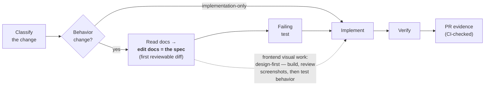
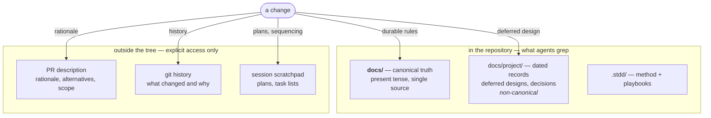

<h1 align="center">stdd</h1>

<p align="center"><strong>S</strong>pec + <strong>T</strong>est <strong>D</strong>riven <strong>D</strong>evelopment — a markdown-first methodology kit for teams building software with AI coding agents.</p>

<p align="center">
  <a href="https://github.com/vsem-azamat/stdd/actions/workflows/ci.yml"></a>
  <a href="https://www.npmjs.com/package/@stdd/cli"></a>
  <a href="https://www.npmjs.com/package/@stdd/cli"></a>
  
  
  <a href="./LICENSE"></a>
</p>

<p align="center">
  <a href="https://www.npmjs.com/package/@stdd/cli"><strong>📦&nbsp; @stdd/cli on npm</strong></a>
</p>

stdd ships five things: a written method contract, agent-neutral playbooks
compiled per agent, a zero-dependency CLI that enforces the mechanical part,
an optional universal Codex/Claude/Pi distribution, and a small public
JavaScript API for integrations. Its distinctive layer is
repository evidence: a docs evidence line on every PR, authority-aware
artifact policy, current-state canonical docs, and stale-proof loop/review
state.

## Why

AI coding agents amplify a specific failure mode: **committed working
artifacts**. Plans and spec files written for one change land in the repo,
go stale, and keep winning code search — an agent greps the tree, finds a
convincing month-old spec, and builds against it. Frameworks that model
changes as committed folders institutionalize this: archives accumulate
authoritative-looking text with no machine-readable authority.

stdd inverts the model. The permanent documentation tree is the source of
truth for current behavior. Once a behavior is agreed, the edit to that tree
is the spec — it becomes the first reviewable diff before the failing test;
exploratory spikes may precede that commitment and are discarded or
reclassified before review. Ephemeral material stays non-canonical: rationale
in the PR description, history in git, and — only when repository policy
allows it — deferred designs as explicitly marked project-log records. What
can be verified mechanically, CI verifies;
the rest is a written contract to review against — not folklore.

## The loop


```mermaid
flowchart LR
    A["Classify<br/>the change"] --> B{"Behavior<br/>change?"}
    B -- "implementation-only" --> E["Implement"]
    B -- "yes" --> C["Read docs →<br/><b>edit docs = the spec</b><br/>(first reviewable diff)"]
    C --> D["Failing<br/>test"]
    D --> E
    E --> F["Verify"]
    F --> G["PR evidence<br/>(CI-checked)"]

    C -. "frontend visual work:<br/>design-first — build, review<br/>screenshots, then test behavior" .-> E
```

## Where knowledge lives

One truth inside the tree; everything ephemeral outside it — an agent
grepping the repository can only find the present. STDD permits one dated
exception by default: a project log marked machine-readably
(`authority: non-canonical`). Repositories that require a strictly
current-state-only tree set `projectLog.enabled` to `false`; generated routing
then forbids creating or searching a project log and the installed method
states that repository override explicitly.


```mermaid
flowchart TD
    CH(["a change"])

    subgraph TREE["in the repository — what agents grep"]
        DOCS["<b>docs/</b> — canonical truth<br/>present tense, single source"]
        LOG["docs/project/ — dated records<br/>deferred designs, decisions<br/><i>non-canonical</i>"]
        STDD[".stdd/ — method + playbooks"]
    end

    subgraph OUT["outside the tree — explicit access only"]
        PR["PR description<br/>rationale, alternatives, scope"]
        GIT["git history<br/>what changed and why"]
        PAD["session scratchpad<br/>plans, task lists"]
    end

    CH -- "durable rules" --> DOCS
    CH -- "deferred design" --> LOG
    CH -- "rationale" --> PR
    CH -- "history" --> GIT
    CH -- "plans, sequencing" --> PAD
```

## Adoption levels

Adopt only the layer that solves today's problem. The layers are cumulative,
but none requires enabling the next:

1. **Personal plugin** — install the universal STDD bundle once through Codex,
   Claude Code, or Pi for its lazy skills and self-contained lifecycle runtime.
   It changes no repository, and its lifecycle integration stays dormant
   outside a checkout containing `.stdd/`.
2. **Shared repository contract** — run `init` once to commit `.stdd/`, native
   agent routing, and the team's policy. Plugin users do not add `@stdd/cli` to
   the adopting repository; the installed bundle runs lifecycle commands with
   the runtime built from its own matching package source.
3. **Enforced contract** — explicitly add generated repository hooks or a CI
   adapter when local guidance must become a team gate. CI remains read-only
   enforcement of checkout and PR facts; it does not consume the private
   ledger or orchestrate agents.

Recorded workflow commands and orchestration remain independently opt-in
inside those layers. A team can start with personal skills, share the contract
later, and add enforcement only when it is worth owning.

## Requirements

- Node.js 20+ and git.
- Secure namespace mutation is supported on Linux x64/arm64, macOS x64/arm64,
  and Windows x64/arm64 through the bundled `stdd-fs` helper. Both the CLI and
  universal plugin include all six binaries for self-contained offline use.
- The protocol-v1 helper reads symbolic links without traversal through held
  parent capabilities and transports their bounded target bytes losslessly;
  it also publishes links with no-replace, identity-bound semantics on every
  packaged target, including Windows x64/arm64.
- A mutating command verifies the selected helper and target filesystem before
  its first target write. The installed package tree is trusted code, while
  target-repository namespace races remain untrusted after session start.
  Missing integrity, identity, no-follow, atomic-rename, or durability
  capabilities fail closed without a best-effort pathname fallback.
- `stdd ci`, `stdd check-pr --pr`, and the forge portion of plain
  `stdd status` shell out to the
  [GitHub CLI](https://cli.github.com) (`gh`), authenticated for the
  repository. `stdd review --via codex|claude` launches the selected
  model-backed CLI and may use its configured network access. `stdd status
  --local` and the remaining local workflow commands are offline.

## Quick start

For personal use, install the universal STDD bundle through a Codex or Claude
Code marketplace, or install its Pi package with `pi install
npm:@stdd/plugin@<version>`. The bundle contains lazy skills and the matching
CLI runtime used by its lifecycle integration; it does not add an npm
dependency or any file to repositories that have not adopted STDD.
`plugins/stdd/` is the marketplace- and package-ready bundle in this source
tree.

To share the contract in a repository, initialize it with a one-off scoped
runner:

```bash
npx --yes @stdd/cli@latest init --tools codex
```

This writes the repository contract but does not modify `package.json` and
does not add CI unless `--ci` is explicitly present. The installed universal
bundle recognizes `.stdd/` in every supported host and runs lifecycle commands
with its bundled runtime.

A project-local exact development dependency remains available when the
repository itself owns generated pre-push/session/stop hooks, or when its
JavaScript code imports the public SDK:

```bash
npm install --save-dev --save-exact @stdd/cli
npm exec --offline --package=@stdd/cli -- stdd init --tools claude,codex,pi --session-hook
```

Inside the `@stdd/cli` source repository itself, generated dogfood automation
invokes the checked-out `cli/stdd.mjs` through the git root. For a one-off
assessment without installing, use `npx @stdd/cli doctor`; a global install
also works. Generated repository automation never relies on a global package
or an unscoped package named `stdd`.

`stdd init` installs `.stdd/` (the method contract + playbooks + config),
generates Claude Code skills in `.claude/skills/` and Agent Skills standard
output for Codex and Pi in `.agents/skills/`, and maintains short managed
sections in `CLAUDE.md`, `AGENTS.md`, and Pi's `.pi/APPEND_SYSTEM.md`.
Everything it
generates is recorded with content hashes in `.stdd/manifest.json`, so
`check` and `doctor` detect hand edits and stale copies of any generated
file — not just version drift.

To assess an existing repository first:

```console
$ npx @stdd/cli doctor
✗ 6 committed working artifacts may mislead coding agents
✗ 2 canonical docs match configured temporal phrases
✓ generated files match stdd v0.8.0
✗ AGENTS.md has no managed STDD routing contract — re-run stdd init for that agent
```

Only when the team wants remote enforcement, explicitly wire the guards into
CI. Provider files are optional read-only adapters around the same CLI
contract; ordinary `init` never creates one:

```console
$ npx @stdd/cli init --ci github
$ npx @stdd/cli init --ci gitlab
$ npx @stdd/cli init --ci generic   # print commands; write no provider file
```

It writes `.github/workflows/stdd.yml`: `stdd check` for tree invariants,
and `stdd check-pr --base` against the PR body **fetched live from the
API**. Do not read the body from `github.event.pull_request.body` — that
payload is frozen at trigger time, so a body-only fix is never re-validated
and a re-run replays the stale text. `stdd doctor` flags workflows using
that form without an `edited` trigger.

GitLab writes an includeable `.gitlab/stdd.gitlab-ci.yml` job. Same-project
merge requests use the short-lived `CI_JOB_TOKEN`. A fork pipeline runs in
the source project, so the target project must put that source project on its
[CI job-token allowlist](https://docs.gitlab.com/ci/jobs/ci_job_token/), or
the job fails with that setup instruction. For a controlled, trusted fork,
`STDD_GITLAB_READ_API_TOKEN` can instead hold a masked and hidden,
target-project access token with only `read_api`. Never expose a target token
to an untrusted fork or run fork-controlled CI code with parent-project
secrets; [GitLab warns that fork code can exfiltrate CI/CD variables](https://docs.gitlab.com/ci/pipelines/merge_request_pipelines/#run-pipelines-in-the-parent-project).
Generic mode prints the portable `check` and `check-pr - --base` commands for
Jenkins, Buildkite, or an existing pipeline.

## Invoke workflows

The playbook source is shared, but each host keeps its native invocation UX:

| Workflow | Claude Code | Codex | Pi |
| --- | --- | --- | --- |
| Start/classify a change | `/stdd-start-change` | `$stdd-start-change` | `/skill:stdd-start-change` |
| Execute docs/red/green/verify | `/stdd-implement` | `$stdd-implement` | `/skill:stdd-implement` |
| Close review, PR, CI, runtime proof | `/stdd-finish-change` | `$stdd-finish-change` | `/skill:stdd-finish-change` |

Descriptions also allow any selected agent to choose a matching skill implicitly.
The always-on instruction files carry only invariants and routing; full
workflows load on demand.

## A change, end to end

```console
$ stdd task start "gross pricing"
$ stdd docs updated-first docs/domain/pricing.md   # commit 1 — the docs edit is the spec
$ stdd red -- npm test                             # commit 2 — failing test, recorded
$ stdd verify -- npm test                          # commit 3 — implementation, green run recorded
$ stdd status
loop:   docs ✓ (updated-first: docs/domain/pricing.md)
        red  ✓ (genuine: yes, exit 1: npm test)
        impl ✓ (checkout changed after the red snapshot)
        verify ✓ (exit 0: npm test)
next:   draft the evidence line via `stdd evidence`, then open the PR
$ stdd evidence --base origin/main
Docs updated first: docs/domain/pricing.md
$ stdd ci --watch
stdd ci: green (5 checks) on 1f0c9e2 — terminal
$ stdd task finish
```

## Commands

| Command | What it does |
| --- | --- |
| `stdd init [dir] [--tools claude,codex,pi] [--ci github,gitlab,generic] [--hooks] [--capabilities <list>] [--session-hook] [--stop-hook] [--interview]` | Install `.stdd/` and compile native skills/instructions per agent; generated CI is pinned to this stdd version, and lifecycle integrations use the project-local binary offline |
| `stdd configure [dir] [--capabilities <list>] [--review-via <route>] [--max-rounds <n>] [--stop-hook]` | Reconfigure capabilities and review routing without changing other project policy |
| `stdd doctor [dir] [--readiness]` | Adoption health report: setup, canonical docs, misleading artifacts, drift, worktree readiness — exits 1 on findings; `--readiness` runs only the config-declared readiness checks |
| `stdd check [dir]` | CI guard: repository artifact policy, configured temporal-phrase heuristic, generated-file integrity, and no tracked bookkeeping (`.stdd/ledger.jsonl`, `.stdd/plan.md`); enforces `branchPattern` and `contentRules` when configured |
| `stdd evidence --base <ref>` | Draft the evidence line from the actual diff: prints a finished `Docs updated first:` line when canonical docs changed; otherwise the remaining sentinel templates go to stderr and it exits nonzero |
| `stdd check-pr <file\|-> [--base <ref>] [--pr <n\|.>]` | CI guard: PR body carries exactly one non-empty docs evidence line; with `--base`, claimed doc paths are verified against the actual git diff; `--pr` fetches and validates the live PR body against its own base and head |
| `stdd task start <name>` / `finish` / `reset [name]` | Open, close, or deliberately replace the active task identity without deleting ledger evidence |
| `stdd status [--json\|--gate\|--local]` | Next-step oracle for the active task; `--local` skips forge access and is used by lifecycle hooks; `--gate` turns broken review claims into an exit code |
| `stdd ci [pr] [--watch] [--interval <s>] [--timeout <s>]` | The branch PR's checks on its **current head**; duplicate rollup entries per check name collapse to the freshest run; `--watch` polls to a terminal state, never settles on a partial check set, restarts when the head moves, exits nonzero on a terminal failure |
| `stdd docs <decision> [paths…] [--reason <why>]` | Record the docs decision (`updated-first`, `checked`, `not-applicable`) in the session ledger when it is made |
| `stdd red -- <cmd>` / `stdd verify -- <cmd>` | Run the command, record `{cmd, exit, excerpt}` in the ledger, pass the exit code through; `red` asserts genuine-red via the config's `redPattern` |
| `stdd note <text>` | Record free-form handoff context in the ledger |
| `stdd defer <text>` | Record a scope cut under the durable plan's `## Deferred` section (`.stdd/plan.md`) |
| `stdd slice new --frozen <globs> --allowed <globs>` | Declare an in-checkout delegated slice and snapshot its Git baseline |
| `stdd worker create <dir> --frozen <globs> --allowed <globs>` | Create a managed gitless snapshot for the active task, with a local evidence ledger and no ignored/Git-private files |
| `stdd worker collect <dir>` | Preflight and idempotently import in-scope sandbox changes plus red/verify/note evidence; never stage, commit, push, or remove the sandbox |
| `stdd scope` | Postflight against the Git or managed-sandbox baseline: worker-introduced changes to frozen paths or outside allowed paths fail; inherited dirt is reported separately |
| `stdd review [--via subagent\|codex\|claude] [--timeout <s>] [--force]` | Build a bounded brief, dispatch a fresh read-only reviewer, record the derived verdict, and invalidate it when the checkout changes |
| `stdd review --result <file\|->` | Complete an open subagent review and securely settle its private temporary artifacts |
| `stdd review --cleanup` | Cancel safely-settleable abandoned subagent or interrupted CLI requests, zero their private artifacts, and move them into a retained identity-bound quarantine |
| `stdd stop-hook [--agent claude\|codex]` | Agent-specific Stop-hook protocol; blocks only broken review claims and otherwise fails open |
| `stdd version` / `stdd --version` | Print the installed CLI version |

## Configuration

All checks read `.stdd/config.json`, merged over built-in defaults:

| Key | Purpose |
| --- | --- |
| `forbiddenArtifacts` | Globs for working artifacts forbidden by this repository's authority policy |
| `canonicalDocs` | Globs for the canonical docs tree; the temporal-phrase heuristic and evidence verification apply to these files |
| `temporalPhrases` | Repository-language phrases heuristically flagged in canonical docs; code spans and fences are skipped |
| `contentRules` | Repo-authored content lints — `{ name, files, forbid` and/or `require, message?, newFilesOnly? }` — enforced by `stdd check` |
| `projectLog.enabled` | Whether the default non-canonical dated project log is permitted; `false` makes generated method/routing forbid it and makes `stdd check` reject tracked `docs/project/**` files |
| `readiness.required` | `{ path, hint }` entries a fresh worktree needs before verification output can be trusted |
| `capabilities` | Agent-environment profile (`subagents`, `crossCli`, `worktrees`); playbooks are compiled against it at init time |
| `baseRef` | Default base ref for diff-derived checks, e.g. `origin/main` |
| `redPattern` | Regex a genuine test failure must match; without it, `stdd red` cannot distinguish a real red from an environment error |
| `branchPattern` | Regex the current branch must match; enforced by `stdd check` |

Project-specific recipes in `.stdd/playbooks/local/` compile through the
same pipeline as the kit's playbooks and override them by `name`.

## Session state

Two per-checkout files under `.stdd/` are working artifacts — advisory
input, never a gate — and the default policy makes `stdd check` fail if
either is tracked by git:

- **`.stdd/ledger.jsonl`** — append-only session ledger. `stdd docs`,
  `red`, `verify`, and `note` append to it; `status` and `evidence` derive
  loop state from it instead of reconstructing it from conversation memory.
- **`.stdd/plan.md`** — durable plan. Checkbox items survive session
  compaction and handoff; an item tagged `[red: <substring>]` counts as
  done only when the ledger holds a matching genuine red run; scope cuts
  are recorded under `## Deferred` with `stdd defer`.

The append-only ledger carries task boundaries. `stdd task start` gives new
work a random `taskId`; `finish` leaves the evidence in place but makes status
idle, and `reset` starts a fresh identity. Existing branch-only ledgers remain
readable, while legacy state on a clean base branch is ignored.

Details: "The session ledger and `stdd status`" in the
[method](method/README.md).

## Repository layout

| Path | Contents |
| --- | --- |
| [`method/`](method/README.md) | The STDD contract: the loop, the rules, the exceptions |
| [`playbooks/`](playbooks/) | Agent-neutral playbooks: start-change, brainstorming, planning, implement, debugging, investigation, worktrees, pr-green, delegate-slice, finish-change |
| [`templates/`](templates/) | PR description and deferred-design templates |
| [`adapters/`](adapters/README.md) | How playbooks compile per agent |
| [`cli/`](cli/) | Zero-dependency Node CLI and isolated adapter modules |
| [`sdk/`](sdk/) | Supported ESM API: config/parsing helpers, safe repository paths, snapshot-aware loop derivation |
| [`plugins/stdd/`](plugins/stdd/) | Universal Codex/Claude/Pi bundle generated from the same playbooks and runtime |

## The method in five rules

1. **Classify first.** Behavior changes (anything observable) pass the full
   loop; implementation-only changes skip the docs step.
2. **The docs edit is the spec.** Once behavior is agreed, missing or stale
   docs are updated before tests and production code, as the first reviewable
   unit. Throwaway exploration may happen earlier but is not implementation
   proof.
3. **Red before green.** A failing test gates every behavior change —
   except frontend *visual* work, which is design-first: build, review
   screenshots, then test only real behavior contracts.
4. **Working artifacts are non-canonical by default.** The default policy
   keeps session plans and ledgers uncommitted. Teams that need an audit
   trail may keep selected records only when their non-canonical authority is
   machine-readable and their canonical-doc search boundary remains intact.
5. **Evidence, not claims.** Every PR states `Docs updated first:` /
   `Docs checked, no change needed:` / `Docs not applicable:` — naming the
   docs or the reason. CI rejects a missing, duplicated, or bare label, and
   with `--base` verifies the claimed doc paths against the actual diff.

The full contract: [`method/README.md`](method/README.md).

## Related work

**[OpenSpec](https://github.com/Fission-AI/OpenSpec)** models changes as
committed folders that archive into the repo, so specs accumulate alongside
a separate docs reality. stdd keeps one truth — the docs tree — and borrows
the delta discipline, drift detection, and init/update UX without the
archive.

**[Superpowers](https://github.com/obra/superpowers)** ships strong,
multi-agent process skills for brainstorming, planning, TDD, debugging, and
delivery. stdd complements that behavior layer with repository-level
evidence: diff-aware PR checks, current-state canonical docs, durable loop
facts, scope snapshots, and stale review invalidation.

## JavaScript API

`@stdd/cli` also exposes a dependency-free ESM entry point for integrations:

```js
import {
	deriveLoopState,
	extractDocPaths,
	mergeConfig,
	parseLedger,
	parsePlan,
	resolveRepoPath,
	STDD_VERSION,
} from "@stdd/cli";
```

The root export is the supported API. It also exports `DEFAULT_CONFIG`,
adapter definitions/renderers, `sha256`, `assertSkillName`, and
`resolveWritableRepoPath`. Imports from
`cli/` are internal and may change between minor versions. TypeScript
declarations ship with the package. The shared printable single-line boundary
accepts ordinary Unicode, including ZWNJ/ZWJ and emoji sequences, but rejects
line/control characters, unpaired surrogates, Unicode `Bidi_Control` code
points, and a fixed denylist of invisible formatting controls before text
reaches task state, logs, or generated agent files.

## Plugin distribution

`plugins/stdd/` is one universal distribution directory. Codex reads its
`.codex-plugin` manifest, Claude Code reads `.claude-plugin`, and Pi installs
the directory as the `@stdd/plugin` package declared by its root
`package.json`. All three hosts consume the same generated conservative-profile
skills and version-aligned CLI runtime, so an adopting repository needs no
local `@stdd/cli`. The bundle does not replace repository initialization,
`.stdd/config.json`, or optional CI enforcement.

Codex and Claude Code use fail-open command hooks. Pi uses a package extension
that restores successful status output on session start or compaction and
queues at most one corrective follow-up after a blocked settled turn. Every
lifecycle path stays dormant without `.stdd/`; runtime failures never trap the
host or inject child errors into a model turn. The installed bundle version
governs lifecycle commands, so compatibility guidance tells users to update
the bundle or re-run initialization.

Run `npm run build:plugin` after changing runtime source, a playbook, host
metadata, native helper artifacts, or the package version. The build validates
all host manifests and helper hashes, regenerates shared skills and the Pi
extension, repairs runtime bytes, and safely retires stale generated skills into a non-loadable quarantine.

## Development

```bash
npm ci
npm test          # node:test — unit + CLI integration
npm run test:harness # opt-in model-backed host contracts; set STDD_AGENT_CONTRACT=1
npm run check     # Biome (Rust) — lint + format, CI mode
npm run format    # Biome — write fixes
npm run build:plugin # regenerate the universal Codex/Claude/Pi bundle
npm run selfcheck # stdd check on this repo (dogfooding)
```

The CLI is being decomposed into an acyclic, flat `cli/*.mjs` module graph. The
end state keeps only argument ordering and dispatch in `cli/stdd.mjs`; lower
modules must be import-pure, must not read `process.argv` at module load, and
may depend only toward lower filesystem/config/state layers. Flat files are
required because the universal plugin mirrors the CLI runtime exactly.

Held-filesystem ownership follows the same direction. Generic inode identity,
helper integrity and protocol negotiation, filesystem capability handles, and
descriptor-bound file observations live below CLI policy. JavaScript owns WAL
schemas, operation order, recovery decisions, and diagnostics; the Rust helper
owns only handle-relative filesystem primitives. Final quarantine basenames
are retained for explicit operator removal because unprivileged Unix APIs
cannot condition unlink on an expected inode. Durable review-provenance
validation lives in `cli/state-validation.mjs`; repository path resolution
stays in `cli/held-fs.mjs`; review provenance capture plus artifact naming,
wipe, and quarantine policy stay in `cli/review-fs.mjs`. Review filesystem code
must not import ledger or snapshot orchestration to obtain lower-level identity
helpers.

A refactor slice moves one cohesive subsystem and its ownership boundary, not a
standalone batch of small helpers. A helper seam is acceptable only when the
same slice uses it to remove the owning subsystem from `cli/stdd.mjs`; callback
facades and copied validation logic do not count as decomposition. Every slice
preserves command output, exit codes, and generated bytes, rebuilds the plugin,
and keeps its committed runtime mirror free of stale files.

The harness defaults to `claude`, `codex`, `pi`, `codex-plugin`,
`claude-plugin`, and `pi-plugin`; pass a subset after `--` when only one
installed CLI is available. Each plugin target installs the same packaged
bundle through the host's native distribution path, then proves skill discovery
and lifecycle activation. The Codex plugin target uses separate invocations:
native skill loading is tool-free and uses no hook-trust bypass; the
lifecycle-only invocation uses Codex's explicit automation bypass for the exact
harness-owned hook package. Claude Code and Pi prove both contracts in one
native invocation. The selected model-backed CLIs must
be installed and authenticated; override their paths with `STDD_CLAUDE_BIN`,
`STDD_CODEX_BIN`, or `STDD_PI_BIN`.

Skill discovery proof is accepted only from a tool-free host transcript:
thinking metadata followed by the exact final proof. Any command, tool use,
tool result, extra assistant text, or unknown transcript event fails the
contract, even when it exposes the proof and the model echoes it exactly.

This repository follows its own method: PRs carry a docs evidence line
(enforced in CI by `stdd check-pr`), and no working artifacts are
committed. See [CONTRIBUTING.md](CONTRIBUTING.md).

## License

[MIT](LICENSE)
