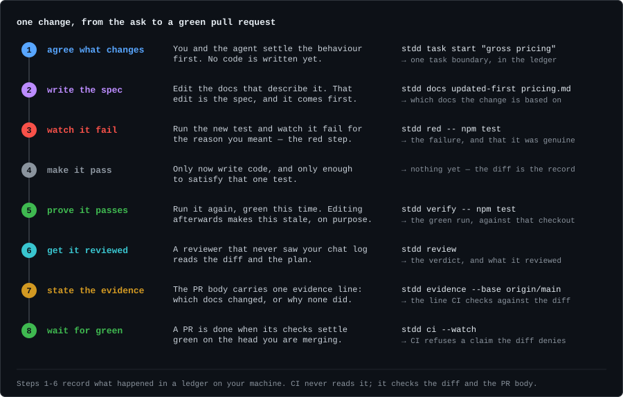
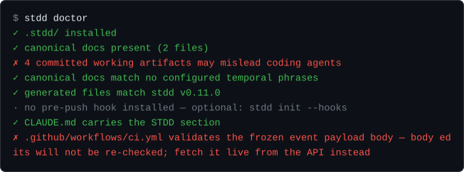
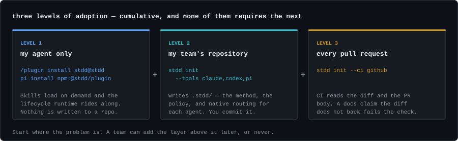

# stdd

**S**pec + **T**est **D**riven **D**evelopment for AI coding agents — a written
method contract, agent-neutral playbooks compiled into native skills, and a
zero-dependency CLI that refuses the claims your repository cannot back.

[](https://github.com/vsem-azamat/stdd/actions/workflows/ci.yml)
[](https://www.npmjs.com/package/@stdd/cli)
[](./LICENSE)

[**Method**](method/README.md) · [**Playbooks**](playbooks/) · [**Privacy**](PRIVACY.md) · [**Terms**](TERMS.md) · [**Contributing**](CONTRIBUTING.md)

An agent can write the code. What a chat log cannot do is survive compaction
and still show which docs the change was based on, or that the test failed
before it passed.

stdd writes those facts to files as they happen, and its gates refuse the
claims the repository cannot back.

## How one change goes



<sup>You rarely type these yourself — the [workflows](#invoke-workflows) run them
for the agent. Implementation-only changes skip step 2, the docs edit; visual
frontend work is design-first, which is rule 3 below.</sup>

```bash
npm i -g @stdd/cli && stdd init
```

That is the middle of [three levels](#three-levels-of-adoption): one below it
changes no repository, one above it turns the contract into a CI gate.

## What it refuses



<sup>`stdd doctor` on a repository that adopted stdd while keeping the plan files
from its previous approach. Real output, hard-wrapped at 76 columns like any
terminal that narrow — the image is generated from it, and a test fails when it
stops matching.</sup>

Those four artifacts are the failure mode this exists for, and it is narrower
than "agents make mistakes". A plan or spec written for one change lands in the
tree, goes stale, and keeps winning code search — an agent greps, finds a
convincing month-old spec, and builds against it.

So inside the tree exactly one place documents intended behavior, the permanent
docs, and everything ephemeral lives outside it: rationale in the PR
description, history in git, plans in the session. The default policy allows one
dated exception — a project log that marks its own authority non-canonical
machine-readably, so a doc search cannot mistake it for current behavior — and a
repository that wants a strictly current-state tree turns even that off. Docs,
tests, and code stay three contracts that have to agree; what stdd removes is
the fourth pile of stale text pretending to be one of them.

The gates refuse a claim no file backs. A PR body claiming a docs edit the diff
does not contain:

```console
$ stdd check-pr pr-body.md --base main
stdd: claimed as updated but not changed against main: docs/domain/auth.md
```

It also refuses a red that looks like an environment error rather than the
failure you meant, refuses to call a PR done until its required checks settle
green on the head you are about to merge, and invalidates a review verdict when
the reviewed content changes underneath it.

## Three levels of adoption



Level 1 is your agent's plugin system — skills and the lifecycle runtime, no
repository touched:

```bash
# Claude Code — in-app
/plugin marketplace add vsem-azamat/stdd
/plugin install stdd@stdd

# Codex
codex plugin marketplace add vsem-azamat/stdd
codex plugin add stdd@stdd

# Pi
pi install npm:@stdd/plugin
```

Levels 2 and 3 are one command in the repository:

```bash
npx --yes @stdd/cli init --tools claude,codex,pi
```

What turns the contract from guidance into a gate is running it where the
agent cannot skip it. Locally that is `--hooks`; in CI it is two commands you
add to a job you already have — `stdd check .` over the checkout, and the live
PR description piped to `stdd check-pr - --base <ref>`. CI stays read-only
enforcement of checkout and PR facts; it never reads the private ledger or
orchestrates agents. A repository that owns generated hooks or
imports the SDK installs the CLI pinned instead of resolving it each time:

```bash
npm install --save-dev --save-exact @stdd/cli
```

## The method in five rules

1. **Classify first.** Current-state diagnosis and future-behavior exploration
   are direct read-only workflows with no task. Explicit intent to persist or
   modify the repository crosses into Start Change; behavior changes then pass
   the full loop, while implementation-only changes skip the docs step.
2. **The docs edit is the spec.** Once behavior is agreed, missing or stale docs
   are updated before tests and production code, as the first reviewable unit.
   Throwaway exploration may happen earlier but is not implementation proof.
3. **Red before green.** A failing test gates every behavior change, and the
   failure has to be the one you meant — except frontend *visual* work, which is
   design-first: build, review screenshots, then test only real behavior
   contracts.
4. **Working artifacts are non-canonical by default.** Session plans and ledgers
   stay uncommitted. Teams that need an audit trail may keep selected records
   only when their non-canonical authority is machine-readable and the
   canonical-doc search boundary stays intact.
5. **Evidence, not claims.** Every PR states `Docs updated first:` /
   `Docs checked, no change needed:` / `Docs not applicable:` — naming the docs
   or the reason. CI rejects a missing, duplicated, or bare label, and with
   `--base` verifies the claimed paths against the actual diff.

The full contract: [`method/README.md`](method/README.md).

## Invoke workflows

You do not type the loop by hand. Each host invokes the same playbooks natively,
and the workflow runs the commands the diagram shows:

| Workflow | Claude Code | Codex | Pi |
| --- | --- | --- | --- |
| Investigate current facts, read-only | `/stdd-investigation` | `$stdd-investigation` | `/skill:stdd-investigation` |
| Explore future behavior, read-only | `/stdd-brainstorming` | `$stdd-brainstorming` | `/skill:stdd-brainstorming` |
| Start/classify persisted or repository-changing action | `/stdd-start-change` | `$stdd-start-change` | `/skill:stdd-start-change` |
| Execute docs/red/green/verify | `/stdd-implement` | `$stdd-implement` | `/skill:stdd-implement` |
| Close review, PR, CI, runtime proof | `/stdd-finish-change` | `$stdd-finish-change` | `/skill:stdd-finish-change` |

Investigation may lead into Brainstorming when unknown current facts materially
affect a design. Reading docs or code during Brainstorming does not require that
handoff. A hypothetical plan in chat stays read-only; Start Change begins only
when the user chooses persistence or repository mutation. Always-on instruction
files carry only invariants and routing; full workflows load on demand.

## Related work

**[OpenSpec](https://github.com/Fission-AI/OpenSpec)** models changes as
committed folders that archive into the repo, so specs accumulate alongside a
separate docs reality. stdd keeps one truth — the docs tree — and borrows the
delta discipline, drift detection, and init/update UX without the archive.

**[Superpowers](https://github.com/obra/superpowers)** ships strong multi-agent
process skills for brainstorming, planning, TDD, debugging, and delivery. stdd
complements that behavior layer with repository-level evidence: diff-aware PR
checks, current-state canonical docs, durable loop facts, scope snapshots, and
stale review invalidation.

## Requirements

Node.js 20+ and git, zero runtime dependencies, on Linux, macOS, and Windows
across x64 and arm64. Offline by default. What reaches out does so through tools
you already have: `stdd ci`, `stdd check-pr --pr`, and the forge portion of plain
`stdd status` use the [GitHub CLI](https://cli.github.com) (`gh`), while
`stdd review --via codex|claude` launches that model-backed CLI, which brings its
own configured network access. Everything else, including `stdd status --local`,
runs without network.

## Reference

<details>
<summary><strong>Commands</strong> — the full CLI surface</summary>

| Command | What it does |
| --- | --- |
| `stdd init [dir] [--tools claude,codex,pi] [--hooks] [--capabilities <list>] [--session-hook] [--stop-hook] [--interview]` | Install `.stdd/` and compile native skills/instructions per agent; lifecycle integrations use the project-local binary offline |
| `stdd configure [dir] [--capabilities <list>] [--review-via <route>] [--max-rounds <n>] [--stop-hook]` | Reconfigure capabilities and review routing without changing other project policy |
| `stdd doctor [dir] [--readiness]` | Adoption health report: setup, canonical docs, misleading artifacts, drift, worktree readiness — exits 1 on findings; `--readiness` runs only the config-declared readiness checks |
| `stdd check [dir]` | CI guard: repository artifact policy, configured temporal-phrase heuristic, generated-file integrity, and no tracked bookkeeping (`.stdd/ledger.jsonl`, `.stdd/plan.md`); enforces `branchPattern` and `contentRules` when configured |
| `stdd evidence --base <ref>` | Draft the evidence line from the actual diff: prints a finished `Docs updated first:` line when canonical docs changed; otherwise the remaining sentinel templates go to stderr and it exits nonzero |
| `stdd check-pr <file\|-> [--base <ref>] [--pr <n\|.>]` | CI guard: PR body carries exactly one non-empty docs evidence line; with `--base`, claimed doc paths are verified against the actual git diff; `--pr` fetches and validates the live PR body against its own base and head |
| `stdd task start <name>` / `finish` / `reset [name]` | Open, close, or deliberately replace the active task identity without deleting ledger evidence |
| `stdd status [--json\|--gate\|--local]` | Next-step oracle for the active task; `--local` skips forge access and is used by lifecycle hooks; `--gate` turns broken review claims into an exit code |
| `stdd ci [pr] [--watch] [--interval <s>] [--timeout <s>]` | The branch PR's checks on its **current head**; duplicate rollup entries per check name collapse to the freshest run; `--watch` polls to a terminal state, never settles on a partial check set, restarts when the head moves, exits nonzero on a terminal failure |
| `stdd docs <decision> [paths…] [--reason <why>]` | Record the docs decision (`updated-first`, `checked`, `not-applicable`) in the session ledger when it is made |
| `stdd red -- <cmd>` / `stdd verify -- <cmd>` | Run the command, record `{cmd, exit, excerpt}` in the ledger, pass the exit code through; `red` asserts genuine-red via the config's `redPattern` |
| `stdd note <text>` | Record free-form handoff context in the ledger |
| `stdd defer <text>` | Record a scope cut under the durable plan's `## Deferred` section (`.stdd/plan.md`) |
| `stdd policy show` | The enforcing view of `.stdd/policy.md`: the grants this kit honors, the advisory notes, and every entry it ignored with the reason |
| `stdd policy add <text>` | Append a project note; it records nuance and grants nothing |
| `stdd policy allow <action> --when <condition>` | Append a standing permission from the closed set `merge`, `deploy`, `publish`, `migrate`, `force-push`, `external-mutation`, naming the condition a session must verify before acting on it |
| `stdd slice new --frozen <globs> --allowed <globs>` | Declare an in-checkout delegated slice and snapshot its Git baseline |
| `stdd worker create <dir> --frozen <globs> --allowed <globs>` | Create a managed gitless snapshot for the active task, with a local evidence ledger and no ignored/Git-private files |
| `stdd worker collect <dir>` | Preflight and idempotently import in-scope sandbox changes plus red/verify/note evidence; never stage, commit, push, or remove the sandbox |
| `stdd scope` | Postflight against the Git or managed-sandbox baseline: worker-introduced changes to frozen paths or outside allowed paths fail; inherited dirt is reported separately |
| `stdd review [--via subagent\|codex\|claude] [--timeout <s>] [--force --reason <why>]` | Build a bounded brief, dispatch a fresh read-only reviewer, record the derived verdict, and invalidate it when the reviewed content changes; past the configured round budget `--force` must state what the extra round should settle, and that reason is recorded |
| `stdd review --result <file\|->` | Complete an open subagent review and securely settle its private temporary artifacts |
| `stdd review --cleanup` | Cancel safely-settleable abandoned subagent or interrupted CLI requests, zero their private artifacts, and move them into a retained identity-bound quarantine |
| `stdd stop-hook [--agent claude\|codex]` | Agent-specific Stop-hook protocol; blocks only broken review claims and otherwise fails open |
| `stdd version` / `stdd --version` | Print the installed CLI version |

</details>

<details>
<summary><strong>Configuration</strong> — <code>.stdd/config.json</code></summary>

All checks read `.stdd/config.json`, merged over built-in defaults:

| Key | Purpose |
| --- | --- |
| `forbiddenArtifacts` | Globs for working artifacts forbidden by this repository's authority policy |
| `canonicalDocs` | Globs for the canonical docs tree; the temporal-phrase heuristic and evidence verification apply to these files |
| `temporalPhrases` | Repository-language phrases heuristically flagged in canonical docs; code spans and fences are skipped |
| `contentRules` | Repo-authored content lints — `{ name, files, forbid` and/or `require, message?, newFilesOnly? }` — enforced by `stdd check` |
| `projectLog.enabled` | Whether the default non-canonical dated project log is permitted; `false` makes generated method/routing forbid it and makes `stdd check` reject tracked `docs/project/**` files |
| `readiness.required` | `{ path, hint }` entries a fresh worktree needs before verification output can be trusted |
| `capabilities` | Agent-environment profile (`subagents`, `crossCli`, `worktrees`); playbooks are compiled against it at init time |
| `review.via` | Default closing-review route (`subagent`, `codex`, `claude`); a route the capability profile cannot dispatch is an error, never a silent fall-back to self-review |
| `review.maxRounds` | How many `changes-requested` rounds a branch may spend before `stdd review` refuses another dispatch; `0` is unlimited. Unbounded re-review does not converge on a large diff |
| `baseRef` | Default base ref for diff-derived checks, e.g. `origin/main` |
| `redPattern` | Regex a genuine test failure must match; without it, `stdd red` cannot distinguish a real red from an environment error |
| `branchPattern` | Regex the current branch must match; enforced by `stdd check` |

Project-specific recipes in `.stdd/playbooks/local/` compile through the same
pipeline as the kit's playbooks and override them by `name`.

</details>

<details>
<summary><strong>Session state</strong> — the ledger, the plan, and the policy</summary>

Two per-checkout files under `.stdd/` are working artifacts — advisory input,
never a gate — and the default policy makes `stdd check` fail if either is
tracked by git:

- **`.stdd/ledger.jsonl`** — append-only session ledger. `stdd docs`, `red`,
  `verify`, and `note` append to it; `status` and `evidence` derive loop state
  from it instead of reconstructing it from conversation memory.
- **`.stdd/plan.md`** — durable plan. Checkbox items survive session compaction
  and handoff; an item tagged `[red: <substring>]` counts as done only when the
  ledger holds a matching genuine red run; scope cuts are recorded under
  `## Deferred` with `stdd defer`.

The append-only ledger carries task boundaries. `stdd task start` gives new work
a random `taskId`; `finish` leaves the evidence in place but makes status idle,
and `reset` starts a fresh identity. Existing branch-only ledgers remain
readable, while legacy state on a clean base branch is ignored.

A third file is deliberately the opposite. **`.stdd/policy.md`** is tracked,
because a standing permission must be visible in a diff and reviewable like any
other rule. Only structured `## Permissions` entries grant anything, and each
names a condition the session verifies before acting; free text that reads like
a permission is still only a note. Sessions read it through `stdd policy show`,
which is where the rules are applied — the raw file is a record, not an
authority.

Details: "The session ledger and `stdd status`" in the
[method](method/README.md).

</details>

<details>
<summary><strong>Repository layout</strong></summary>

| Path | Contents |
| --- | --- |
| [`method/`](method/README.md) | The STDD contract: the loop, the rules, the exceptions. `reference-*.md` beside it holds the mechanisms — generated state, host integration, command internals — so the contract a session reads before every change stays short |
| [`playbooks/`](playbooks/) | Agent-neutral playbooks: start-change, brainstorming, planning, implement, debugging, investigation, worktrees, pr-green, delegate-slice, finish-change |
| [`templates/`](templates/) | PR description and deferred-design templates |
| [`adapters/`](adapters/README.md) | How playbooks compile per agent |
| [`cli/`](cli/) | Zero-dependency Node CLI and isolated adapter modules |
| [`sdk/`](sdk/) | Supported ESM API: config/parsing helpers, safe repository paths, snapshot-aware loop derivation |
| [`plugins/stdd/`](plugins/stdd/) | Universal Codex/Claude/Pi bundle generated from the same playbooks and runtime |

</details>

<details>
<summary><strong>Plugin distribution</strong> — one bundle, three hosts</summary>

`plugins/stdd/` is one universal distribution directory. Codex reads its
`.codex-plugin` manifest, Claude Code reads `.claude-plugin`, and Pi installs
the directory as the `@stdd/plugin` package declared by its root
`package.json`. All three hosts consume the same generated conservative-profile
skills and version-aligned CLI runtime, so an adopting repository needs no local
`@stdd/cli`. The bundle does not replace repository initialization,
`.stdd/config.json`, or optional CI enforcement.

Codex and Claude Code use fail-open command hooks. Pi uses a package extension
that restores successful status output on session start or compaction and queues
at most one corrective follow-up after a blocked settled turn. Every lifecycle
path stays dormant without `.stdd/`; runtime failures never trap the host or
inject child errors into a model turn. The installed bundle version governs
lifecycle commands, so compatibility guidance tells users to update the bundle
or re-run initialization.

Run `npm run build:plugin` after changing runtime source, a playbook, host
metadata, native helper artifacts, or the package version. The build validates
all host manifests and helper hashes, regenerates shared skills and the Pi
extension, repairs runtime bytes, and safely retires stale generated skills into
a non-loadable quarantine.

</details>

<details>
<summary><strong>JavaScript API</strong> — <code>@stdd/cli</code> as an ESM import</summary>

`@stdd/cli` also exposes a dependency-free ESM entry point for integrations:

```js
import {
	deriveLoopState,
	extractDocPaths,
	mergeConfig,
	parseLedger,
	parsePlan,
	resolveRepoPath,
	STDD_VERSION,
} from "@stdd/cli";
```

The root export is the supported API. It also exports `DEFAULT_CONFIG`, adapter
definitions/renderers, `sha256`, `assertSkillName`, and
`resolveWritableRepoPath`. Imports from `cli/` are internal and may change
between minor versions. TypeScript declarations ship with the package. The
shared printable single-line boundary accepts ordinary Unicode, including
ZWNJ/ZWJ and emoji sequences, but rejects line/control characters, unpaired
surrogates, Unicode `Bidi_Control` code points, and a fixed denylist of
invisible formatting controls before text reaches task state, logs, or generated
agent files.

</details>

## Privacy

stdd runs locally and ships no telemetry. [PRIVACY.md](PRIVACY.md) describes
what is stored, where, and what leaves your machine.

## Contributing

This repository follows its own method: PRs carry a docs evidence line enforced
by `stdd check-pr`, and no working artifacts are committed. Module boundaries,
the refactor-slice rule, the agent-contract harness, and the release procedure
are in [CONTRIBUTING.md](CONTRIBUTING.md).

## License

[MIT](LICENSE)
